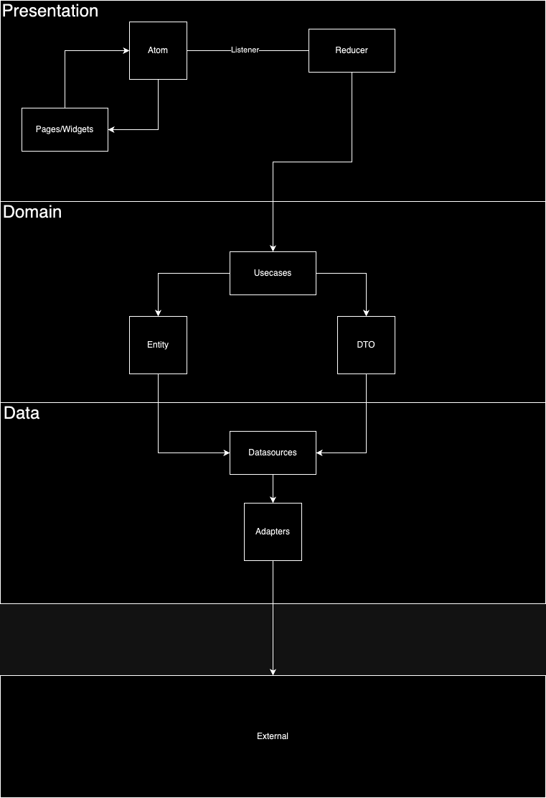

# Real time messaging chat

A real-time messaging application using websockets.
It is associated with the following [backend project](https://github.com/mudrek/whatsapp-back).

## What will you find in this project?

* Authentication using username and password
* Account creation
* Logged-in user stored in LocalStorage
* Automatic login if already logged in
* Logout functionality clearing LocalStorage
* List of chats being updated in real-time using WebSockets
* User search to start a conversation
* Real-time conversation with another user using WebSockets.

## Architecture

## Important libraries used

* [Flutter Modular](https://pub.dev/packages/flutter_modular)
* [ASP](https://pub.dev/packages/asp)
* [Flutter Secured Storage](https://pub.dev/packages/flutter_secure_storage)
* [Stomp Dart Client](https://pub.dev/packages/stomp_dart_client)

## Screens

## How to run this project
Firstly, it will be necessary to configure the backend.

Once the configuration is done, it will be necessary to run the project:
* Flutter 3.13.6
* Tested Devices: IPhone 14, IPhone SE, Pixel3a

If necessary, you can change the backend URL in the main.dart file.
